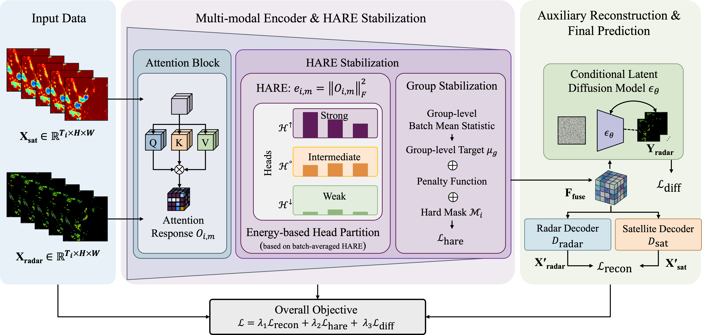

# HARECast-ACM Multimedia 2026
Official implementation of "[Stable Attention Response for Reliable Precipitation Nowcasting]()"



## Code

### arXiv Link

Please visit [arXiv](https://arxiv.org/abs/2605.13181) for more information.

### Environment

```shell
conda create -n HARECast python=3.10 -y
conda activate HARECast
pip install -r requirement.txt
```
### Resource
Pretrained HARECast: [Google Drive](https://drive.google.com/file/d/1gm1gHCSC0qgH9oqKcF-W4M3YZ13fJRJt/view?usp=share_link) </br>

### Evaluation
```shell
# Note: Config the dataset path in `dataset/get_dataset.py` before running.
python run.py --eval --ckpt_milestone ckpt.pt
```
### Backbone Training
```shell
python run.py
```

### Display Video

You can view the video by downloading it [here](resources/display_video.mp4).
